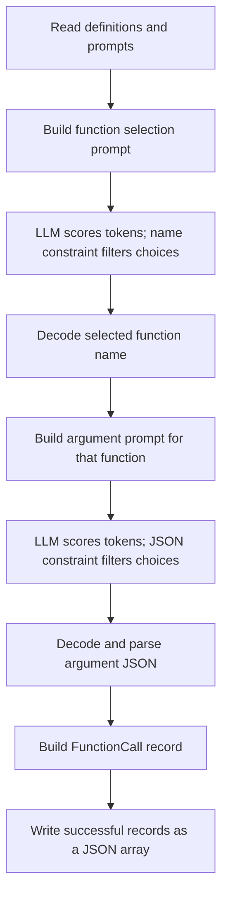

*This project has been created as part of the 42 curriculum by YOUR_42_LOGIN.*

# Call Me Maybe: the beginner guide

Replace `YOUR_42_LOGIN` above with your actual 42 login before submission.

This guide explains the project using small examples and everyday comparisons. You can also read the [interview guide](docs/interview/README.md) or follow the [learning roadmap](docs/learning/README.md).

## Description

Imagine a robot sitting beside a toolbox. Someone says, “Please add 2 and 3.” The robot's job here is to write a work order:

```json
{
  "prompt": "What is the sum of 2 and 3?",
  "name": "fn_add_numbers",
  "parameters": {"a": 2, "b": 3}
}
```

The work order names the tool and supplies the information it needs. Another program could use it to perform the addition. This project stops at producing the work order: it does not execute the named functions.

The robot is a small language model, or **LLM**. An LLM predicts pieces of text. It can understand a request but still make mistakes when writing a strict computer format. This project adds rules to control which pieces it can write next. That technique is called **constrained decoding**.

The assignment in [en.subject.pdf](en.subject.pdf), version 1.2, requires LLM-based function selection, correct arguments, and valid JSON that matches the function definitions. It targets at least 90% accuracy, 100% JSON/schema validity, and processing the test prompts in under five minutes on standard hardware. These are assignment targets, not measured achievements of this implementation.

**Current status:** the project has the main pipeline, but its decoding rules and validation are incomplete. The saved output contains mistakes. The sections below explain both the design and the parts that still need work.

## A few words before we start

| Word | Simple meaning | Example here |
| --- | --- | --- |
| Function | A named operation with inputs | `fn_add_numbers` |
| Parameter | A named input slot | `a` and `b` |
| Argument | The actual value put in a slot | `2` and `3` |
| Prompt | The request given to the model | “Greet shrek” |
| String | Text | `"shrek"` |
| Integer | A whole number | `3` |
| Number | A numeric value, possibly with a decimal | `3` or `3.5` |
| Boolean | One of two truth values | JSON `true` or `false` |
| JSON | A text format for structured information | `{"name": "shrek"}` |
| Schema | Rules describing the expected fields and types | `name` must be a string |
| Token | One piece of text the model can choose | A letter, word fragment, or punctuation |
| Token ID | The number used to identify a token | An illustrative ID such as `17` |
| Vocabulary | The collection of tokens and their IDs | The model's token lookup table |
| Logit | A raw score for a possible next token | A larger score is preferred by greedy selection |
| Validation | Checking whether data follows rules | Checking that every argument exists |

A token is not necessarily a word or a character. One token might contain several characters, such as `true`, or punctuation and text together. The IDs in teaching examples are invented; real IDs come from the model's vocabulary.

## Instructions

### What you need

The project declares Python 3.10 or newer and uses `uv` to manage dependencies. The provided `llm_sdk` folder must sit beside `src`, because [pyproject.toml](pyproject.toml) points to it as a local dependency. The default model identifier in the source is `Qwen/Qwen3-0.6B`.

From the repository root, install the declared dependencies and run the program:

```sh
uv sync
uv run python -m src
```

`python -m src` means “run the `src` package”; Python starts [src/__main__.py](src/__main__.py). The default paths are relative to the directory where you run the command.

To select files explicitly with the **current implementation**:

```sh
uv run python -m src \
  --functions-definition data/input/functions_definition.json \
  --input data/input/function_calling_tests.json \
  --output data/output/function_calling_results.json
```

You can view the available flags or start the Python debugger with:

```sh
uv run python -m src --help
uv run python -m pdb -m src
```

The source also accepts `--model Qwen/Qwen3-0.6B`. Compatibility with another model depends on its SDK behavior and vocabulary.

**There is a CLI mismatch to fix:** the subject specifies `--functions_definition` with an underscore. The source registers `--functions-definition` with a hyphen. The commands above match the source; the subject's spelling is not currently accepted.

The [Makefile](Makefile) was empty when reviewed. Commands such as `make run` and `make lint` have no implemented targets yet. The application and dependency installation were not run for this documentation review, so these instructions describe the configured entry point, not a verified successful model run.

## The files and what they do

The subject was read first. Then all eight Python files in `src`, all other root project files, both input files, and the existing output file were reviewed. The complete `uv.lock` was parsed, including package metadata and artifact records. `.venv`, `llm_sdk`, Python cache files/folders, and `src/.claude` were excluded. Git's internal database was not treated as project source.

| File | Its job |
| --- | --- |
| [en.subject.pdf](en.subject.pdf) | The assignment's rulebook. |
| [README.md](README.md) | This beginner explanation; it was empty before this documentation work. |
| [pyproject.toml](pyproject.toml) | Project name, Python requirement, dependencies, and package build settings. |
| [uv.lock](uv.lock) | Resolved dependency versions, platform conditions, download locations, and hashes. |
| [Makefile](Makefile) | Intended home for shortcuts such as `install`, `run`, `debug`, `clean`, and `lint`; currently empty. |
| [.gitignore](.gitignore) | Currently contains `venv` and `data/output/`. The `venv` pattern does not cover `.venv` by that name. |
| [src/__init__.py](src/__init__.py) | Empty package marker; defines no functions. |
| [src/__main__.py](src/__main__.py) | Starts the application and coordinates the batch. |
| [src/models.py](src/models.py) | Describes the input and output data using Pydantic. |
| [src/loader.py](src/loader.py) | Reads input JSON and writes result JSON. |
| [src/caller.py](src/caller.py) | Builds the two prompts and assembles a function-call record. |
| [src/generator.py](src/generator.py) | Selects tokens while applying a constraint. |
| [src/constraints.py](src/constraints.py) | Tracks which text is allowed next. |
| [src/vocab.py](src/vocab.py) | Reads token mappings and groups tokens by their text. |
| [data/input/functions_definition.json](data/input/functions_definition.json) | Five available function descriptions. |
| [data/input/function_calling_tests.json](data/input/function_calling_tests.json) | Eleven requests to process. |
| `data/output/function_calling_results.json` | An existing output artifact with eleven records; generated output is ignored by Git. |

The five function descriptions are addition, greeting, reversing a string, square root, and regular-expression replacement. These are data entries describing tools. There are no Python implementations of those five tools in `src`.

The main dependencies are NumPy, Pydantic, and the local SDK. NumPy works with the token scores; Pydantic checks declared data shapes. The lockfile also lists dependencies of dependencies. Its SDK entry depends on `torch`, `transformers`, and `huggingface-hub`; this information comes from the root lockfile, not from reading the excluded SDK. The assignment prohibits directly using those model frameworks in your solution; use the provided SDK's public interface.

## Follow one request through the project

Consider “What is the sum of 2 and 3?”



1. The loader reads the toolbox descriptions and the list of requests.
2. `FunctionCaller` writes a prompt listing the function names, parameter names, and function descriptions.
3. The model scores possible next tokens. `NameConstraint` tries to restrict the answer to a known function name, such as `fn_add_numbers`.
4. The caller looks up that function's parameter schema: `a` is a number and `b` is a number.
5. It creates a second prompt asking for the arguments. `JsonConstraint` tries to guide the answer into an object such as `{"a":2,"b":3}`.
6. `json.loads` turns the generated JSON text into a Python dictionary.
7. `FunctionCall` holds the original prompt, chosen name, and parameter dictionary.
8. At the end of the batch, `JsonIO.write_results` writes the records as a JSON array.

The model generates the function name and argument text. Python supplies the outer `prompt`, `name`, and `parameters` fields when building and serializing the record.

## Algorithm explanation: choosing only allowed pieces

### The score filter

Imagine choosing the next piece of a puzzle. The model gives every piece a score. The constraint identifies pieces that fit the current position. The generator gives forbidden pieces a score of negative infinity, written `-np.inf`, and chooses the highest remaining score.

Here is an invented example at a position where only an opening brace is allowed:

| Candidate token | Original score | Allowed? | Score after filtering |
| --- | --- | --- | --- |
| `Hello` | 9 | No | Negative infinity |
| `{` | 4 | Yes | 4 |
| `}` | 6 | No | Negative infinity |

Even though `Hello` had the best original score, `{` wins after filtering. This selection method is **greedy decoding**: choose the best-scoring allowed token at each step. Scores do not need to be converted to probabilities just to compare their order.

In [Generator.generate](src/generator.py), the loop copies the prompt IDs, requests logits, computes legal token IDs, creates a Boolean mask, replaces forbidden scores, picks `np.argmax`, and appends the chosen ID to both the full context and the new output. Then it advances the constraint's state. Each generation has a limit of 256 iterations.

The rules must be correct for this method to be reliable. If the rulebook accidentally permits a bad piece, the model can still choose it.

### The name tree

`NameConstraint` uses a **trie**, a tree of characters. Picture paths spelling `fn_greet` and `fn_get_square_root`. Their first characters share a path, and later letters branch apart. A terminal marker says, “A complete name ends here.”

The constraint looks for tokens whose text fits a possible continuation. After choosing a token, it walks through its characters in the tree. This separates two responsibilities: the model supplies preferences, and the tree tries to limit the choices to the function catalog.

The current implementation has edge cases: a token extending past a valid name can be admitted and then rejected while advancing; reaching a shorter complete name stops generation even when a longer name shares that prefix. The search also has a 32-character remaining-depth limit.

### The JSON progress tracker

`JsonConstraint` is a **finite-state machine**. That means it remembers one of a limited set of stages, much like a board game piece sitting on a square.

For `{"a":2,"b":3}`, the intended journey is:

```text
Current stage   + next piece -> New stage
START           + {          -> AFTER_BRACE
AFTER_BRACE     + "          -> IN_KEY
IN_KEY          + a          -> IN_KEY (key text is now complete)
IN_KEY          + "          -> AFTER_KEY
AFTER_KEY       + :          -> BEFORE_VALUE
BEFORE_VALUE    + 2          -> IN_NUMBER
IN_NUMBER       + ,          -> AFTER_BRACE
... repeat the key/value steps for b and 3 ...
IN_NUMBER       + }          -> DONE
```

This teaching example uses one-character tokens; actual token splits depend on the vocabulary. String values use `IN_STRING`, then `AFTER_VALUE` after their closing quote. Booleans use `IN_BOOL`.

The tracker stores the schema, current state, emitted keys, current key, key progress, and a value buffer. It chooses keys in their definition order. It marks a key emitted when the key's closing quote is consumed, before its value is complete.

A complete checker would allow `}` only after all required values were complete. This implementation allows it too early after some values, which helps explain the missing arguments in the saved output.

## Every function, explained simply

### `src/models.py`: the forms

`ParameterSpec` describes one slot with a `type` and optional description. `FunctionDefinition` describes a tool with a name, description, parameter dictionary, and return specification. `PromptItem` holds a nonempty request. `FunctionCall` holds the final record.

`PromptItem.not_blank(cls, v)` checks whether a prompt contains anything other than whitespace. It uses `v.strip()` to check, but returns the original `v`, preserving the user's spaces. It raises `ValueError` for whitespace-only input. The decorators make it a Pydantic field validator and a class method.

`TYPE_MAP` associates `number`, `string`, `boolean`, and `integer` with Python types. It is currently unused. `FunctionCall.parameters` is `dict[str, Any]`, so constructing a record does not check the arguments against the selected function's schema. Writing down a dictionary type is less strict than checking every required slot.

### `src/loader.py`: the file helper

| Function | What it does |
| --- | --- |
| `JsonIO._read_json(path)` | Opens a UTF-8 file with `with`, reads JSON, and returns the decoded Python object. Converts missing-file and malformed-JSON errors into `JsonIOErorr`. |
| `JsonIO.load_function_definitions(path)` | Reads JSON, then uses `TypeAdapter(list[FunctionDefinition])` to validate the list and its entries. Wraps Pydantic validation failures. |
| `JsonIO.load_prompts(path)` | Validates a list of `PromptItem` objects, then returns just their prompt strings. |
| `JsonIO.write_results(path, records)` | Creates parent directories, converts each record using `model_dump()`, and writes indented JSON. Wraps output `OSError` failures. |

`JsonIOErorr` is the actual exception name in the code, including the spelling. An exception is a signal that an operation failed. `raise ... from exc` preserves the original cause. A `with` block closes a file when the block ends, even if an error occurs.

The methods are static methods: you can call them on `JsonIO` without constructing an object. Input permission errors and decoding errors are not all covered by `_read_json`'s two exception handlers.

### `src/vocab.py`: the token dictionary

| Function | What it does |
| --- | --- |
| `Vocabulary.__init__(vocab_path)` | Reads either a direct token-to-ID mapping or one nested under `model.vocab`; reverses it into ID-to-token form; builds token groups. |
| `Vocabulary.surface(token_id)` | Looks up the token string and replaces `Ġ` with a space and `Ċ` with a newline. |
| `Vocabulary.ids_where(predicate)` | Checks every token and returns IDs whose text passes a supplied yes/no function. |
| `Vocabulary.tokens_extending(prefix, candidates)` | Keeps candidate IDs whose token text starts with `prefix`; currently unused elsewhere. |

The groups are `structural` for punctuation, `digit_like` for number-looking characters, `string_safe` for text without quotes or selected control characters, and `bool_tokens` for pieces of `true` and `false`.

`_BOOL_SUBSTRINGS` builds substrings of those Boolean words, including capitalized and uppercase variants. `_CONTROL_CHAR_RE` is a regular expression detecting certain control characters. A regular expression is a pattern for matching text.

These groups are rough filters. For example, a backslash passes `string_safe`, but JSON gives backslashes special escape rules. Replacing two token markers is also not proof that every token's text matches the SDK decoder exactly.

### `src/constraints.py`: the rulekeepers

| Function | What it does |
| --- | --- |
| `_TrieNode.__init__()` | Creates a node with a dictionary of child characters and a terminal flag initially set to false. |
| `NameConstraint.__init__(valid_names)` | Inserts each name into the character tree and starts at the root. |
| `NameConstraint.legal_tokens(vocab)` | Finds possible remaining name strings and filters token surfaces against them. |
| Nested `ok(surface)` | Performs the prefix comparison used by the name filter. |
| `NameConstraint.advance(token_id, vocab)` | Walks through the chosen token's characters; stops at a terminal node or newline; raises if a character has no matching branch. |
| `NameConstraint.is_complete()` | Reports whether name generation has finished. |
| `NameConstraint._reachable_prefixes(node, max_depth=32)` | Uses a stack to find suffix paths ending at complete names within the depth limit. Despite the name, its returned strings end at terminal nodes. |
| `JsonConstraint.__init__(schema)` | Stores the expected fields and initializes the progress tracker. |
| `JsonConstraint.legal_tokens(vocab)` | Selects allowed token groups based on the current state and expected value type. |
| Nested `key_ok(surface)` | Checks whether a token fits the remaining characters of the selected key. |
| `JsonConstraint.advance(token_id, vocab)` | Updates the state, key progress, emitted keys, or value buffer after a token. |
| `JsonConstraint.is_complete()` | Checks whether the state is `DONE`. |
| `JsonConstraint._remaining_keys()` | Lists schema keys not yet marked emitted. |
| `JsonConstraint._pick_next_key()` | Returns the first remaining key, or raises `RuntimeError` if there are none. |

`_State` is a class containing string constants for the states; it has no methods. A leading underscore is a Python convention for an internal implementation detail.

The value buffer collects numeric/Boolean fragments but is not used to validate their grammar. `DONE` currently means the tracker accepted a closing brace, not that the whole schema was independently checked.

### `src/generator.py`: the piece chooser

| Function | What it does |
| --- | --- |
| `Generator.__init__(model, vocabulary)` | Stores the model and vocabulary to use during generation. |
| `Generator.next_logits(input_ids)` | Calls the SDK's public logits method and converts the result to a NumPy `float32` array. |
| `Generator.generate(initial_ids, constraint)` | Runs the masked greedy token-selection loop and returns only newly produced IDs. |

`ControlledGenerationError` is a custom exception used when the constraint returns no legal tokens. The generator assumes the logits are a one-dimensional vector indexed by token ID. It does not currently validate that shape or reject unfinished output when the step limit is reached.

### `src/caller.py`: the request coordinator

| Function | What it does |
| --- | --- |
| `_selection_prompt(prompt, functions)` | Builds the instruction and function catalog for choosing a name. |
| `_arg_prompt(prompt, name, schema)` | Builds the instruction for filling the selected function's arguments, listing their names and types. |
| `FunctionCaller.__init__(generator, vocabulary, functions_by_name)` | Stores the generator, vocabulary, and function lookup dictionary. Its stored vocabulary is currently unused. |
| `FunctionCaller.process(prompt)` | Encodes the selection prompt, generates and decodes a name, gets its schema, generates argument JSON, parses it, and returns `FunctionCall`. |

The argument prompt does not include the function description, parameter descriptions, or return type. The caller obtains the model through `self._generator._model`, an internal attribute of your own `Generator`. That is coupling between your classes; it is not access to a private SDK attribute.

The caller expects `encode(...)` to return something supporting `.squeeze(0).tolist()`. SDK compatibility was not verified because its folder was excluded.

### `src/__main__.py`: the organizer

`_parse_args()` defines the three file paths and model flag and returns the parsed command-line options.

`main()` reads definitions and prompts; loads the model and vocabulary; builds the generator and caller; processes each prompt; collects successful records; and writes the output. It prints clear errors and exits with status 1 for the input, initialization, and output failures it catches.

Inside the prompt loop it catches only `ControlledGenerationError`, logs a warning, and skips that prompt. Other failures, such as malformed generated JSON, can still escape. Skipping a prompt also means the output may have fewer records than the input.

## Design decisions

The code splits work into small modules so that file reading, token rules, generation, and prompt construction can be understood separately. It uses two model generations per request: choosing a function first narrows the schema needed for the second step.

Pydantic validates input records. A trie represents allowed function names. A state machine represents argument structure. NumPy makes score masking straightforward. Sets collect allowed IDs, and `frozenset` makes precomputed groups immutable. Greedy selection avoids a separate random-sampling implementation.

These are visible design choices. The original author's reasons and development history were not available, so the explanations describe their practical effects rather than inventing a personal story.

## Challenges faced and remaining work

The main challenge is keeping model-written text on a legal path. The current code tackles this using masks, a name tree, and JSON states. However, the rules still admit invalid paths:

| Problem | Concrete example or effect |
| --- | --- |
| Missing required fields | The tracker can finish `{"a":2}` even when `b` is required. |
| Loose number rules | `{"a":+2}` can be permitted although it is invalid JSON. An `integer` slot can accept `1.2`. |
| Loose Boolean rules | Pieces such as `f` can be followed by `}`, producing invalid JSON. |
| Incomplete string rules | An unescaped backslash sequence such as `\x` can be admitted. |
| Empty schema handling | After `{`, a quote is allowed even when there are no keys, then selecting a key raises. |
| Name constraints | Overlong tokens and names sharing prefixes expose trie edge cases. |
| Generation termination | Hitting 256 steps returns the unfinished token list without an explicit failure. |
| Final argument checks | `dict[str, Any]` does not check missing keys, extra keys, or schema-specific value types. |

Other work remains: support the subject's flag spelling; implement the Makefile; complete exception handling, annotations, and docstrings; verify the SDK contract; and reconcile the subject's requirement that all classes use Pydantic with the ordinary helper classes in this implementation. Schema type names are currently unrestricted strings, even though the decoder only branches on four primitive types.

These findings are explanations of the current source. This documentation update does not repair the application.

## Performance analysis

The existing result file has eleven records and parses as JSON. Three regular-expression records contain only `source_string`, omitting both `regex` and `replacement`. The request to reverse `hello` contains `"s": "olleh"`; the argument should be the original `"hello"`, because the selected tool would perform the reversal later.

These four visibly incorrect records leave at most 7 of 11 fully correct records, or about 63.6%, in that saved artifact. This is an upper bound from inspecting an existing file, not a benchmark of the current code or evidence about when/how the file was generated.

No fresh model accuracy or runtime was measured. Each request uses two bounded generation loops; each loop can make up to 256 logits calls. Many `ids_where` calls scan the full vocabulary, so filtering work grows with vocabulary size and output length. Model inference also contributes to runtime. A real speed claim needs a timed run on identified hardware.

## Testing strategy

For this documentation review, the source and saved data were inspected, the full lockfile was parsed, and the actual constraint classes were exercised with a tiny artificial vocabulary. Those probes reproduced early closure, an invalid leading plus, a decimal in an integer slot, an incomplete Boolean, an invalid string escape, and name/empty-schema failures. They did not load the LLM or inspect the excluded folders.

To validate the application itself, test three different things:

1. **Can the output be read as JSON?** A JSON parser checks its syntax.
2. **Does it follow the chosen function's rules?** Check the exact keys, all required arguments, and their types.
3. **Does it match the user's request?** Check that the selected function and values express the right operation.

For example, `{"s":"olleh"}` passes a string-type check but is the wrong argument for “Reverse the string 'hello'.” Passing one check does not imply passing the others.

A basic syntax check after a run is:

```sh
uv run python -m json.tool data/output/function_calling_results.json
```

This checks parsing only. Future tests should cover different function catalogs, missing files, malformed JSON, blank prompts, negative and large numbers, escaped quotes, backslashes, Unicode, booleans, empty parameter objects, shared name prefixes, truncated generation, and missing/extra arguments. Measure accuracy over every input prompt, including failures and skipped prompts.

## Resources

Start with the local [subject](en.subject.pdf) for the project's requirements. The [Python tutorial](https://docs.python.org/3/tutorial/) covers language basics; it assumes some programming experience, so use the tiny exercises in the learning guide alongside it. The [JSON module documentation](https://docs.python.org/3/library/json.html) explains reading and writing JSON.

For the libraries used here, consult [Pydantic models](https://docs.pydantic.dev/latest/concepts/models/), [Pydantic TypeAdapter](https://docs.pydantic.dev/latest/concepts/type_adapter/), [NumPy argmax](https://numpy.org/doc/stable/reference/generated/numpy.argmax.html), and [uv locking and syncing](https://docs.astral.sh/uv/concepts/projects/sync/). The [JSON specification](https://www.rfc-editor.org/rfc/rfc8259) is the reference for the grammar your decoder needs to enforce.

**AI use in this documentation work:** an AI assistant read the subject and permitted project files, explained each source function, checked selected constraint behaviors with an artificial vocabulary, and wrote these three guides. It did not modify the application source or run the model. Earlier AI involvement in the implementation is unknown; the author should add any relevant history before submission and verify that they can explain the code themselves.
