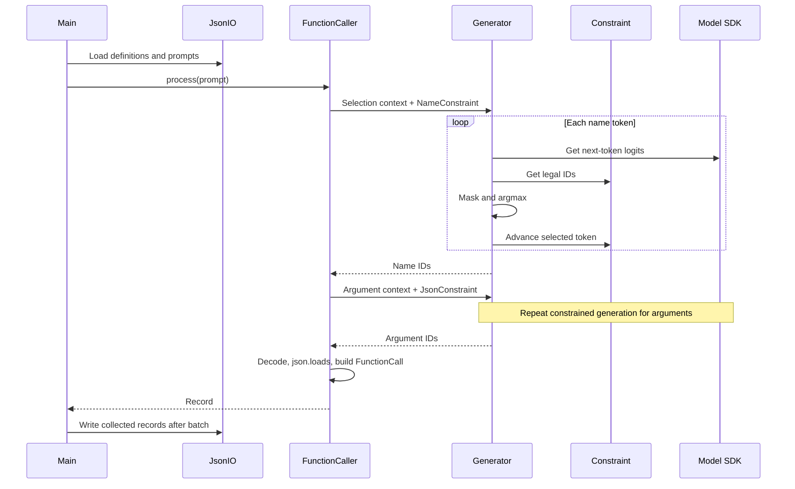

# Call Me Maybe: explaining the project in an interview

[Beginner guide](../../README.md) · [Learning roadmap](../learning/README.md) · [Assignment](../../en.subject.pdf)

This guide is grounded in the current source and existing data. Suggested interview wording describes the implementation without claiming unmeasured performance or completed fixes.

## A 60-second explanation

> This is a Python function-calling pipeline that translates a natural-language request into a function name and a dictionary of arguments. It uses the provided small-model SDK, with Qwen/Qwen3-0.6B configured as the default. The output describes a call; the program does not execute the tool.
>
> The pipeline separates function selection from argument extraction. It first constrains name generation using a character trie built from the supplied function catalog. It then generates arguments using a state machine driven by the selected schema. At each decoding step, it masks disallowed token logits with negative infinity and greedily selects the highest-scoring remaining token.
>
> The architecture is implemented, but its validity guarantees are incomplete. The current state machine admits some malformed values and can finish before all required arguments are present. I would describe it as a prototype requiring stricter grammar enforcement, final schema validation, and measured evaluation before making reliability claims.

## The problem and its contract

For this input:

```text
Reverse the string 'hello'
```

the desired record is:

```json
{
  "prompt": "Reverse the string 'hello'",
  "name": "fn_reverse_string",
  "parameters": {"s": "hello"}
}
```

`"olleh"` would be the result of executing the tool, not the argument to supply. This distinction matters because a model may answer the user's question instead of describing the intended call.

The outer output is an array. Every record must contain exactly `prompt`, `name`, and `parameters`. The name must exist in the supplied catalog, and arguments must match the selected function's parameter names and types. The function catalog and prompts may change during evaluation, so selection must remain model-driven and catalog-dependent.

The assignment targets at least 90% correct function/argument extraction, 100% syntactic and schema validity, and processing the test set in under five minutes on standard hardware. It requires Python 3.10+, the provided SDK, constrained decoding, Pydantic, typing, docstrings, linting, and graceful errors. These targets are separate from current implementation evidence.

## Architecture and ownership

| Module | Responsibility | Boundary concern |
| --- | --- | --- |
| [models.py](../../src/models.py) | Pydantic definitions, prompt validation, output record shape | Final argument dictionary uses `Any`, so it is not tied to a selected schema. |
| [loader.py](../../src/loader.py) | JSON I/O and list validation with `TypeAdapter` | Input exception wrapping covers only some file failures. |
| [vocab.py](../../src/vocab.py) | Token mappings, surface conversion, reusable token groups | Surface text needs to agree with actual decoder behavior. |
| [constraints.py](../../src/constraints.py) | Name trie and JSON state transitions | Correct legal-token computation is the central correctness obligation. |
| [generator.py](../../src/generator.py) | SDK logits access and masked greedy generation | Assumes a flat score vector and lacks a final completeness check. |
| [caller.py](../../src/caller.py) | Two prompt templates, two generation passes, record assembly | Reaches into `Generator._model` and parses unvalidated generated arguments. |
| [__main__.py](../../src/__main__.py) | CLI, initialization, batch loop, result writing | Skips controlled generation failures and catches no other per-prompt failures. |
| [__init__.py](../../src/__init__.py) | Package marker | Empty. |

Runtime flow:



The output envelope is assembled in Python. The model generates the name and argument object, reducing the structure the decoder must generate.

## How constrained decoding works

For a context of token IDs, the SDK returns next-token scores. Let `L` be the IDs legal under the current constraint state. The generator sets scores outside `L` to negative infinity and chooses the index of the highest remaining score.

```text
scores = next_logits(context)
legal = constraint.legal_tokens(vocabulary)
scores[IDs outside legal] = -infinity
chosen = argmax(scores)
context.append(chosen)
output.append(chosen)
constraint.advance(chosen)
```

This is a simplified description, not replacement code. The real implementation checks whether the constraint is complete before each step and raises `ControlledGenerationError` if the returned legal set is empty. It uses NumPy `float32` scores and a Boolean mask.

Softmax is unnecessary for greedy ranking because it preserves the ordering of finite logits. Greedy selection is locally optimal, not a search for the highest-probability complete function call. Shared prefixes can make that distinction visible.

Three conditions are needed for a structural guarantee:

1. Every admitted token must preserve a prefix that can still become valid output.
2. The transition must account for the entire token surface, including tokens spanning grammar boundaries.
3. Generation may return success only in an accepting state, with a final schema check as defense in depth.

The current implementation does not fully satisfy these conditions. A correct mask also cannot prove that a syntactically valid argument is the value intended by the user.

## Function selection: trie details

`_TrieNode` stores `children: dict[str, _TrieNode]` and a terminal Boolean. The constructor inserts every catalog name character by character. Memory for the tree is bounded by the total number of characters inserted, with shared prefixes reducing duplicated nodes.

`_reachable_prefixes` performs a depth-first traversal using an explicit stack. It returns remaining strings that end at terminal nodes, with a default remaining depth of 32. `legal_tokens` admits surfaces that are prefixes of those strings **or extend those strings**. The second comparison is too permissive: a token `fn_xy` may pass for the only allowed name `fn_x`, then fail while `advance` processes `y`.

The constraint marks itself complete whenever it reaches a terminal node after consuming a token. With names `fn_x` and `fn_xy`, generating a token ending at `fn_x` prevents later continuation to `fn_xy`. A single token spelling the longer name may still reach it; accessibility depends on tokenization. A newline option exists at terminal nodes, but normal terminal advancement already sets completion.

An improved design needs explicit stopping semantics for a terminal node that still has children and must reject token suffixes that leave the trie. It should also handle long names without an arbitrary traversal cutoff causing false dead ends.

## Argument generation: state-machine details

`JsonConstraint` stores the schema, current state, emitted keys, current key, key progress, and a value buffer. Keys are emitted in schema insertion order, using `_pick_next_key`. This removes key-order choice from the model, while allowing it to choose argument contents.

The states are `START`, `AFTER_BRACE`, `IN_KEY`, `AFTER_KEY`, `BEFORE_VALUE`, `IN_NUMBER`, `IN_STRING`, `IN_BOOL`, `AFTER_VALUE`, and `DONE`. The intended primitive types are string, number, integer, and boolean. Arrays, nested objects, nulls, optional fields, and enums are not implemented by this schema representation and decoder.

The implementation filters broad token categories rather than parsing complete number, Boolean, and string grammars. Many punctuation positions require an exact one-character token. Consequently, valid tokens crossing boundaries can be excluded, while malformed sequences assembled from broadly allowed pieces can be admitted.

For number starts, the expression combining `structural & digit_like` contributes no IDs for ordinary punctuation: those groups are disjoint under the current definitions. The union with the subsequent predicate supplies the useful candidates. Later numeric states accept broad numeric-looking fragments without inspecting the accumulated buffer.

An improved transition function should simulate consumption of every character or byte of a candidate token, retain only candidates leaving a valid continuation, and track completed values separately from emitted key names. Escaping of schema keys and exact tokenizer behavior also need explicit treatment.

## Why these design choices are reasonable

| Choice | Benefit | Cost or limitation |
| --- | --- | --- |
| Two generation passes | Selection and extraction can be inspected separately; the second stage sees a narrower schema. | Two contexts and decoding loops; an incorrect function choice propagates into argument extraction. |
| Trie for names | Represents the runtime catalog without hardcoded dispatch heuristics. | Prefix termination and whole-token handling need careful design. |
| Explicit JSON states | Makes legal transitions inspectable and testable. | Broad character classes are insufficient for full JSON correctness. |
| Pydantic for data boundaries | Validates nested input structures and provides structured errors. | A broad output model does not automatically validate a runtime schema. |
| Greedy masked selection | Straightforward implementation and inspectable token choices. | No backtracking or global optimization; model preferences can still produce wrong values. |
| Precomputed token groups | Reuses common structural classifications. | Many state-specific filters still rescan the vocabulary. |
| Serialize records with `json.dump` | Python constructs the final envelope and escapes its strings. | Serialization cannot restore missing arguments or correct their meaning. |

These are inferred engineering tradeoffs from the code, not a record of the author's original decisions.

## Current correctness findings

| Finding | Evidence | Practical consequence |
| --- | --- | --- |
| Premature object closure | A synthetic-vocabulary probe accepted `{"a":2}` for a schema requiring `a` and `b`. | Parseable JSON can omit required arguments. |
| Invalid numeric grammar | A probe accepted `{"a":+2}` as complete. | The subsequent JSON parser can raise. |
| Integer type not enforced | A probe accepted `1.2` for an integer field. | Valid JSON can violate the schema. |
| Boolean fragments not tracked | A probe accepted `{"a":f}`. | The substring token set does not enforce `true` or `false`. |
| Escapes not tracked | A probe admitted `\x` inside a string. | `string_safe` is not a full JSON string validator. |
| Empty-schema path | After `{`, the opening quote is legal; advancement then tries to pick a nonexistent key. | A valid zero-argument function can encounter a runtime error. |
| Name filter and advancement disagree | An overlong name token passed filtering and raised `ValueError` on advancement. | A supposedly legal choice can crash generation. |
| Unchecked generation cap | Source returns `produced` after 256 iterations without checking completion. | Truncated output reaches decoding and parsing. |
| Weak final validation | `FunctionCall.parameters` is `dict[str, Any]`; `TYPE_MAP` is unused. | No independent exact-key/type check follows parsing. |
| Incomplete error boundary | Per-prompt code catches only `ControlledGenerationError`. | Parser, schema lookup, transition, and inference failures may escape. |

There are additional numerical/API assumptions: legal IDs must index the score vector; logits must have the expected shape; and at least one usable legal score must remain. A nonempty legal set with all IDs outside the score vector leaves an all-false mask. The implementation should reject this case instead of applying `argmax` to all negative infinities. NaNs and nonfinite values also need deliberate handling.

Input validation accepts arbitrary schema type strings and does not reject duplicate names. Creating `functions_by_name` silently keeps the last definition for a duplicate name. Default Pydantic model behavior is not configured here to forbid extra input fields or enforce strict primitive coercion rules.

## Requirements and integration gaps

The source registers `--functions-definition`; the subject requires `--functions_definition`. The Makefile is empty. Several ordinary classes do not use Pydantic despite the subject's all-classes wording. Many functions lack docstrings, and `Vocabulary.ids_where` has an untyped predicate parameter. No lint/type-check pass was established during this documentation work.

The subject documents `get_path_to_vocabulary_json()`, while the entry point calls `get_path_to_vocab_file()`. It describes `encode` as returning a list, while the caller uses `.squeeze(0).tolist()`. These are **unverified interface differences**, not proof that the bundled SDK is broken: the SDK folder was deliberately excluded from inspection. The project must ultimately match the supplied SDK's public contract.

The source imports the SDK through its public class and methods. Access to `Generator._model` is a local encapsulation issue, not a private SDK access. The lockfile lists model frameworks as SDK dependencies; their presence there is distinct from importing them directly into the solution.

## What can honestly be said about performance

The reviewed saved output contains eleven records. All eleven are parseable as part of one JSON array. Three regex-replacement records omit `regex` and `replacement`; the `hello` reversal record supplies an already-reversed argument. Those four errors imply an upper bound of 7/11, approximately 63.6%, fully correct records in that artifact. Its provenance is unverified, so this is not a measured run of the current implementation.

No model latency, peak memory, cold-start time, or current accuracy was measured. The subject's targets must not be presented as achieved results.

For `P` prompts and a per-pass limit `T = 256`, the two-pass pipeline performs at most `2PT` logits calls if both passes reach their cap for every prompt. This is a call-count bound, not a runtime estimate. Generation context grows by one token per step. The SDK's internal caching and inference cost were not inspected.

`Vocabulary.ids_where` scans all `V` vocabulary entries. With a roughly bounded number of predicates per step, common filtering work scales with `TV` per pass. Name filtering also depends on the number and lengths of reachable suffixes; it is not simply constant work per vocabulary entry. Mask creation, score conversion, and argmax each touch the vocabulary-sized score vector.

Potential optimizations include caching legal sets for reusable states, indexing tokens by initial characters, avoiding repeated full-vocabulary surface conversions, and using public SDK caching facilities if available. Profile first; these are proposals, not implemented features.

## Validation strategy to explain to a reviewer

The documentation review used source inspection, JSON/TOML parsing, and deterministic probes of the actual constraint classes using a temporary artificial vocabulary. It did not run the model or inspect `.venv`, `llm_sdk`, Python caches, or `src/.claude`.

A stronger evaluation should separate four metrics: output coverage, JSON parse rate, schema validity rate, and semantic accuracy. Count skipped prompts and failures in the total denominator. Record model ID, dataset, hardware, elapsed time, and whether startup/model loading is included.

Use unit tests for parser states and schema checks, a fake model with controlled logits for generation behavior, and end-to-end tests with the required model. Test unseen function catalogs, prefix-sharing names, no-argument functions, alternative token splits, escaped strings, full number syntax, malformed inputs, wrong types, and generation limits. Treat an existing output file as a fixture to inspect, not automatically as ground truth.

For regex arguments, different patterns can be semantically equivalent. Where appropriate, a separate evaluation harness can compare behavior on approved test strings rather than demanding one literal pattern. That evaluation activity is distinct from adding tool execution to this application.

## Common interview questions

**Why does prompting alone not solve this?** Prompting influences token preferences. It does not remove structurally invalid continuations from the available choices. The mask enforces a set of choices at each step, assuming that set is computed correctly.

**Does constrained decoding guarantee the right answer?** It can guarantee a specified language or schema with a correct implementation and successful completion. It cannot guarantee semantic intent. `{"a":2,"b":9}` can be structurally valid for a request to add 2 and 3.

**Why still validate after decoding?** Final validation catches disagreements between tokenizer surfaces, transitions, schema handling, and serialization. It provides a boundary invariant before a record is accepted. It supplements correct decoding rather than replacing it.

**How would you add a new primitive type?** Define its input schema representation, its accepted value grammar, legal token transitions, completion condition, and final validator. Add positive and negative tests with several token segmentations. Changing only `TYPE_MAP` would have no effect because that mapping is unused.

**How would you handle an unsupported request?** The current schema expects a function call and has no abstention record. I would first establish the intended policy and contract, rather than inventing an extra output key. The present code always attempts selection from the catalog.

**What would you fix first?** Prevent acceptance of incomplete or malformed argument objects, add exact schema validation, and make generation/processing failures controlled. Then resolve CLI and submission requirements, verify the SDK interface, and benchmark on held-out prompts. Optimize after correctness is measurable.

**What did AI do?** For this documentation update, AI reviewed permitted files, checked targeted constraint behavior, and wrote the explanations and roadmap. Earlier implementation history is unknown. Any personal interview account should accurately reflect the author's own work and understanding.

## Run and study references

From the root, the configured commands are `uv sync` and `uv run python -m src`. The current CLI spelling is shown in the [beginner instructions](../../README.md#instructions). These commands were not run against the LLM in this review.

Use the [JSON specification](https://www.rfc-editor.org/rfc/rfc8259) for syntax, [Pydantic models](https://docs.pydantic.dev/latest/concepts/models/) for validation behavior, [NumPy argmax](https://numpy.org/doc/stable/reference/generated/numpy.argmax.html) for selection, and [uv locking and syncing](https://docs.astral.sh/uv/concepts/projects/sync/) for environment reproducibility. The [learning roadmap](../learning/README.md) turns these topics into implementation exercises.
